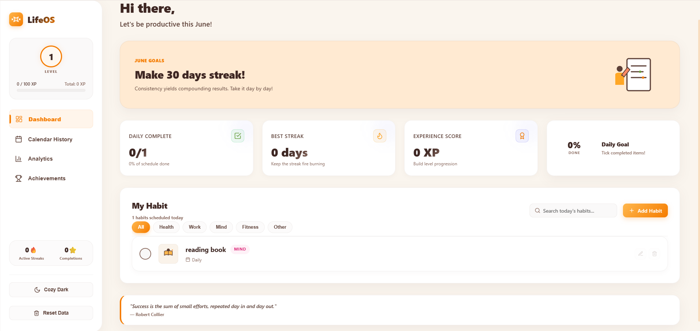
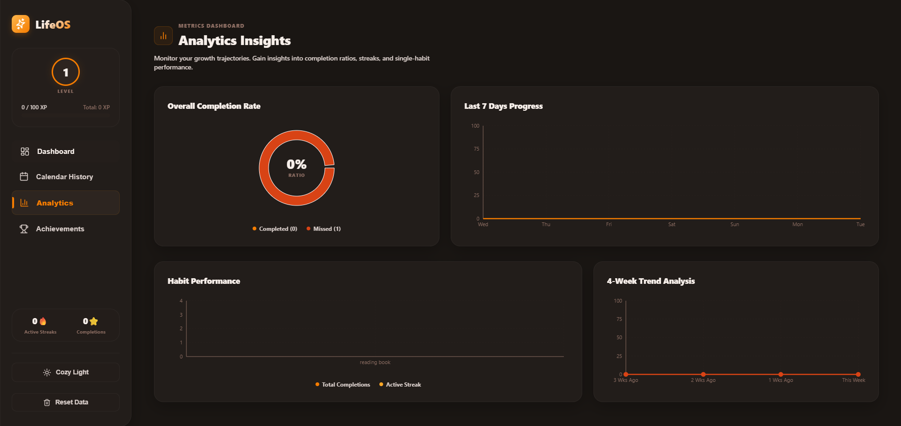
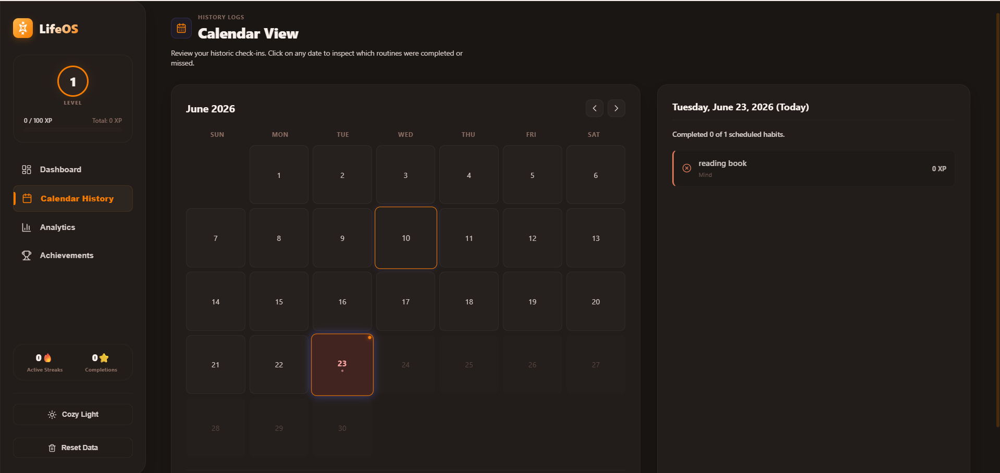
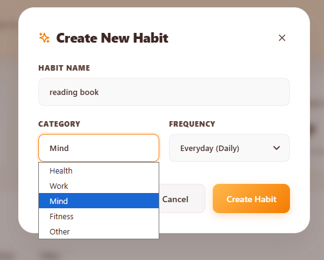
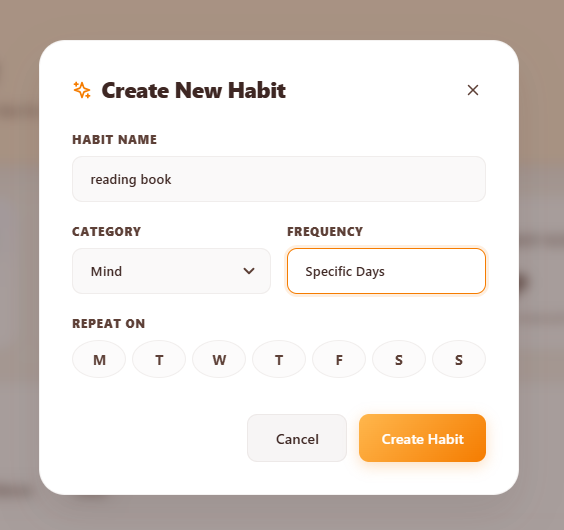
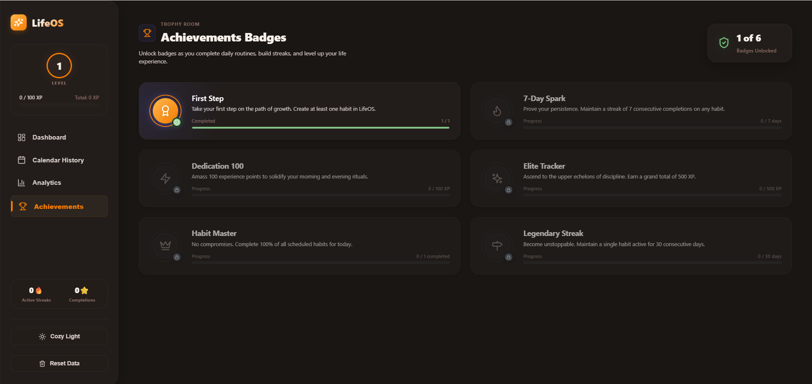
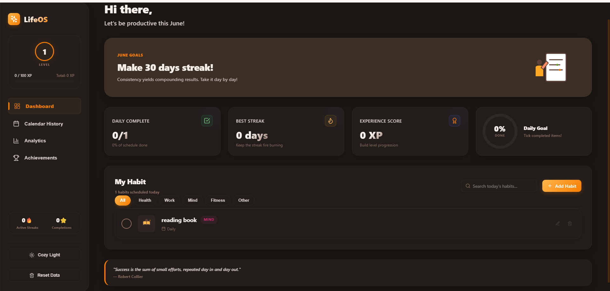

# LifeOS Habit Tracker

A modern and responsive habit tracking application designed to help users build consistency, maintain positive habits, and monitor progress through streaks, analytics, achievements, and calendar-based tracking.

## Live Demo

https://lifeos-habit-tracker.vercel.app/

## Features

### Habit Management

* Add new habits
* Edit existing habits
* Delete habits
* Organize daily routines

### Progress Tracking

* Mark habits as completed
* Monitor daily consistency
* Track habit completion history

### Streak System

* Maintain daily streaks
* Visual progress indicators
* Motivation through consistency tracking

### Analytics Dashboard

* View overall progress
* Analyze completion rates
* Monitor habit performance

### Calendar View

* View habit activity by date
* Track historical progress
* Easy navigation across days

### Achievement System

* Unlock achievements based on consistency
* Track milestones and progress
* Encourage long-term habit building

### Dark Mode

* Toggle between light and dark themes
* Improved user experience across environments

### Responsive Design

* Mobile-friendly interface
* Optimized for desktop and tablet devices

---

## Screenshots

### Dashboard



### Analytics



### Calendar



### Add Habit



### Habit Days



### Achievements



### Dark Mode



---

## Tech Stack

### Frontend

* React
* JavaScript
* CSS

### Build Tool

* Vite

### Deployment

* Vercel

### Version Control

* Git
* GitHub

---

## Installation

Clone the repository:

```bash
git clone YOUR_REPOSITORY_URL
```

Navigate to the project folder:

```bash
cd habit-tracker
```

Install dependencies:

```bash
npm install
```

Start the development server:

```bash
npm run dev
```

Build for production:

```bash
npm run build
```

---

## Project Structure

```text
habit-tracker
├── public
│   └── screenshots
├── src
├── package.json
├── vite.config.js
├── README.md
└── index.html
```

---

## Future Improvements

* User Authentication
* Cloud Data Synchronization
* Habit Reminders
* Email Notifications
* Social Habit Challenges
* Advanced Analytics
* Goal Tracking
* AI-Based Habit Recommendations

---

## Project Objective

The objective of LifeOS Habit Tracker is to help users develop productive routines, maintain consistency, and achieve personal goals through a simple and engaging habit-tracking experience.

---

## Author

Neel Kalekar

GitHub: https://github.com/neel141106-lang
